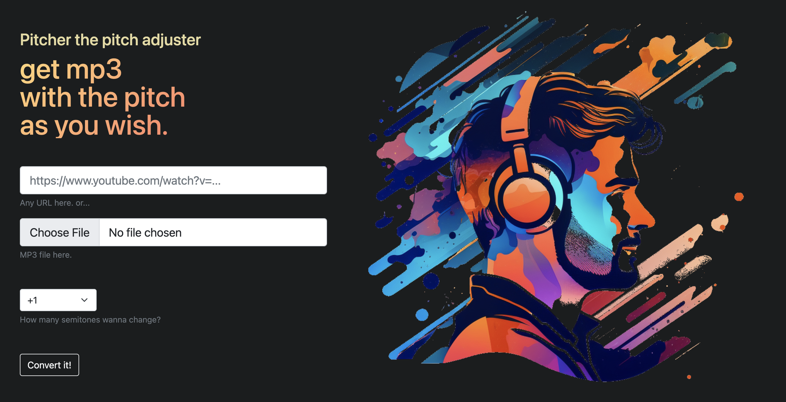

# Pitcher



Specify any YouTube url and you'll get pitch-adjusted mp3 file of it.

You can change the pitch of your file in local as well.

## Setup
```
pip install pydub
pip install yt_dlp
pip install librosa
```

## Usage

### CLI version
```
# Download mp3 then pitch up with two semitones
python main.py --url 'https://www.youtube.com/watch?v=HWHz3x_CZAA' --semitones 2
# Download only
python main.py --url 'https://www.youtube.com/watch?v=4tlUwgtgdZA' --semitones 0
# Load local mp3 then pitch down with three semitones
python main.py --input_path path_to_your_file --semitones -3
```
### Web UI version
```
flask --app app run
```